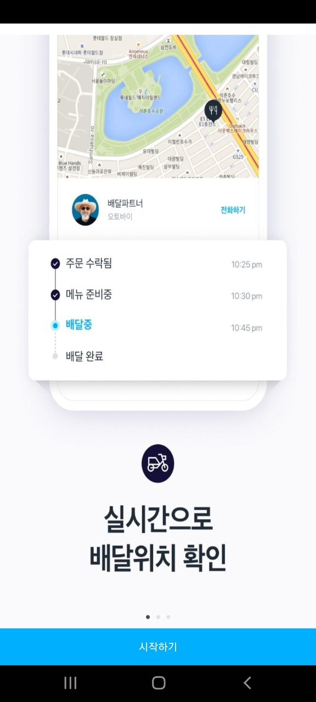
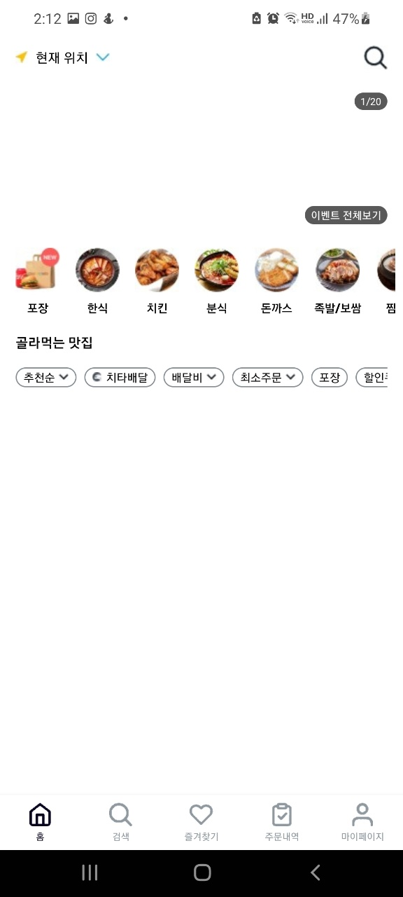
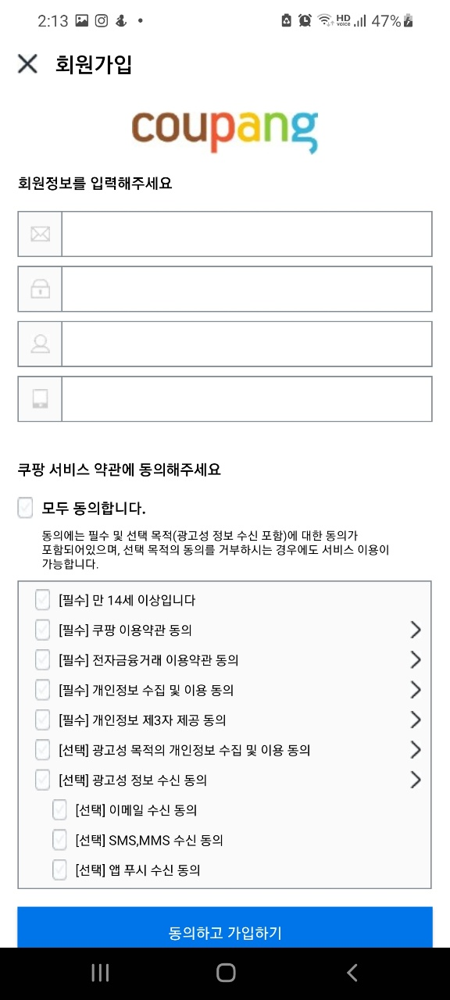

# coupangEatsA-test-server-haena

Rising Test

## 2022-03-19 진행상황

  - 기획서 작성
  - EC2 인스턴스 구축
  - RDS 데이터베이스 구축
  - localhost:9009 포트 연결 확인
  - ERD 설계 완료
    - https://aquerytool.com/aquerymain/index/?rurl=e4a2c069-adcf-423d-9e44-11c53c677c0b
    - passward : a74vd2

## 2022-03-20 진행상황
      
### API 리스트 관련
- 회원가입 API 구현
- 로그인 API 구현
- 홈 화면 조회 API 구현 (거리 관련 제외)
<br>
- validation 구현
- 인가 구현
- 

### 기타
- DB 테이블 생성
- ERD 수정
- RESTful API 리스트업
  - https://docs.google.com/spreadsheets/d/1VIkuCFoaXgTUkJoDqHE50YlTO9RZGANg/edit?usp=sharing&ouid=108228008875958634623&rtpof=true&sd=true
- 더미데이터 추가

### TODO
- 회원가입 시, 비밀번호 정규식 심화 구현
- 홈 화면 조회 시 거리 관련 정보 구현

## 2022-03-21 진행상황

### API 리스트 관련

- 홈화면 API 수정 
  - 정렬, 필터 기능 추가
- 가게 상세화면 조회 API 구현
  - storeIdx Params -> String
  - storeIdx 존재 하지 않을 경우 예외처리 추가


### 트러블 슈팅
```Optional int parameter 'storeIdx' is present but cannot be translated into a null value due to being declared as a primitive type.```
- storeIdx를 RequestParam으로 받을 때 int일 경우 null 값으로 처리할 수 없기 때문에 발생한 에러
    - -> String 값으로 받아 null 값을 확인한 후, 아닐 경우 int로 바꾸어 진행할 수 있게 하였다.
    - **22-03-22 수정**
      - requestParam 값에 default 값을 설정해주면 int 형으로 받아도 해결 가능하였다.
      - `@RequstParam(value='', required='false', defaultValue="0")`

### 위클리 스크럼 내용
#### 작업한 부분 공유
#### 구팽 
  - 필요한 아이템은 다 정의를 해둔 상태. 가게 리스트 화면은 아직 데이터가 없어 연결하지 않음.
  - 
    - 
    - 
    - 
    - 
    - 

#### 해나
- EC2 인스턴스 구축
- RDS 데이터베이스 구축
- ERD 설계 완료
- RESTful API 리스트업

- API 관련
  - 회원가입 API 구현
  - 로그인 API 구현
  - 홈 화면 조회 API 구현 (거리 관련 제외)
  - 가게 상세화면 조회 API 구현  
  <br>
#### 궁금한 점 공유
  - 사장님 입장에서의 API도 만들어야 할까? -> 사장님 앱이 따로 있으므로, 더미 데이터만 집어 넣는 쪽으로 하기로 함.
  - 회원가입 시, 사용자의 위치 정보를 쿼리 스트링으로 보내도 되는가? -> 회원 가입 시에는 필요 없을 것 같음.
  - 로그인 시 위치정보를 Response 해주어야 하는가? -> 로그인 시에 위치 정보가, 위치 권한을 동의한 위치로 설정되므로 안 해주어도 될 것 같다.
  - 가게 카테고리가 일대일이 아닌 일대 다이기 때문에 테이블을 따로 해주어야 할 것 같다.
  - 가게 매장 정보, 원산지 정보 등을 저장 하는 것은 DB에서 항목별로 나누어 관리해야 하는가? -> 피드백 시간에 여쭤 보기로 함.
  - 가격에 원 단위를 붙이는 것은 서버에서 해주어야 하는가? -> int형태로 넘겨주면 클라이언트에서 작업하기로 함
  - 매장과 사용자와의 거리 계산 -> 매장의 위도, 경도 정보를 넘겨주면 클라이언트에서 작업해주기로 함.


## 2022-03-22 진행상황
- 메뉴 상세화면 조회 API 구현
- 홈화면 조회 API에 카테고리 별 조회 추가
- 집 주소, 회사, 기타 주소 관리 API 구현
- 기타 주소 추가 API 구현
- 주소 조회 API 구현
- build 시도 ->  `gradle build daemon disappeared unexpectedly (it may have been killed or may have crashed)`에러 발생 -> 내일 다시 시도

### 서버 피드백 내용
- API 구축 순서는 클라이언트와 상의해서 클라이언트의 진행 상황에 맞게 맞추어 나가는 것이 좋다.
- 서버 빌드 후 API 테스트를 해보는 것을 추천한다.
- API 명세서에 캡쳐 화면 추가
- 가게 영업시간 같은 경우는 테이블을 따로 만들어야 한다.


## 2022-03-23 진행상황
- 회원 가입 시 필요한 입력값 정규식 수정, 보완
- 3개 이상 연속되거나 동일한 문자/숫자 제외 구현
- 가게 상세 화면 API에 포토 리뷰 추가

- build 성공
  - GET메소드는 성공했지만, POST메소드에서 `Request method 'GET' not supported` 에러 발생

## 2022-03-24 진행상황
- 배달 카드 담기 API 구현
- 배탁 카트 새로 담기 API 구현
- 주소 관련 API DB 수정
  - 사용자 집, 회사 관련 정보를 기타 주소지 정보와 함게 UserAddress 테이블에 담기로 함.

## 2022-03-25 진행상황
- 홈화면 API 수정
- 가게 상세 화면 API 수정
- 주소 관련 API 수정
- 배달 카트 수정 API 구현